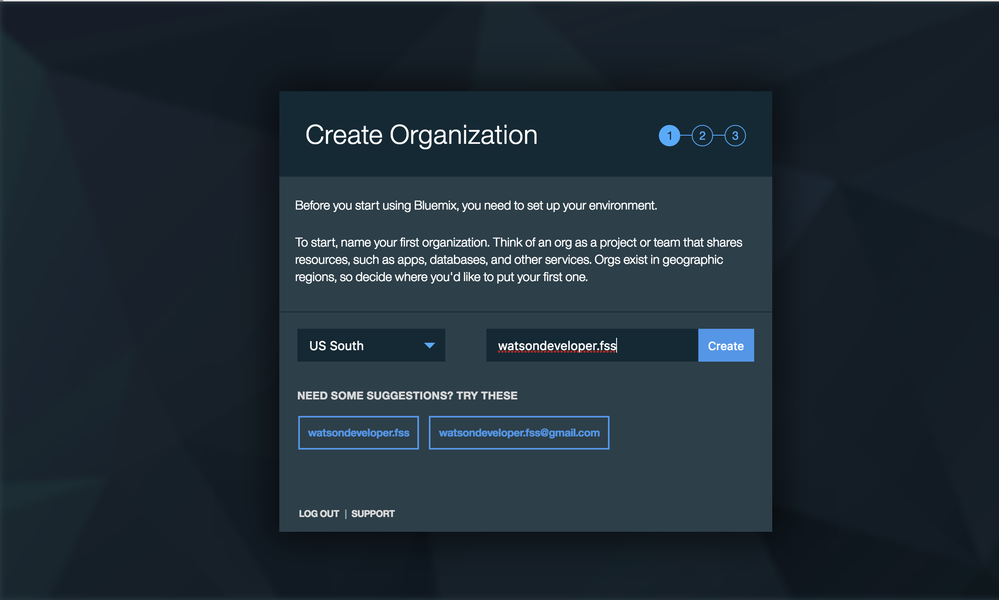
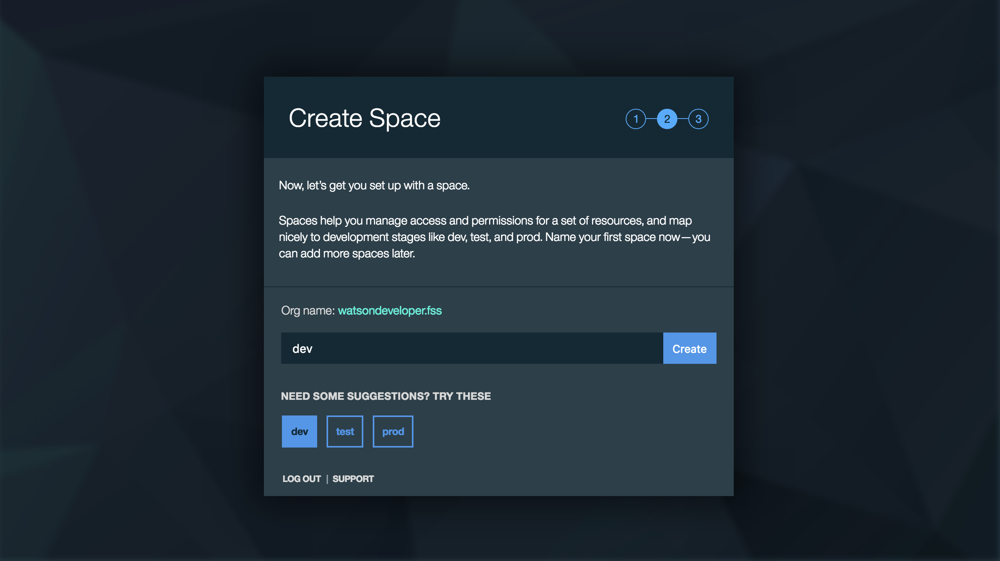
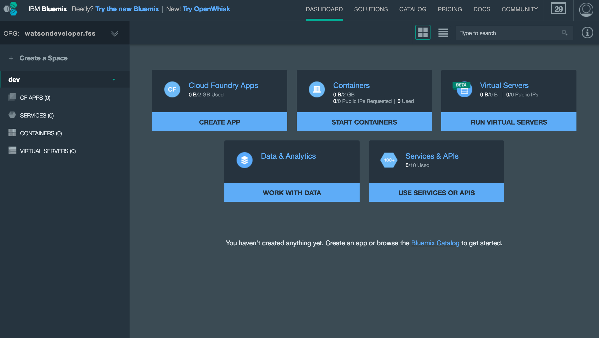
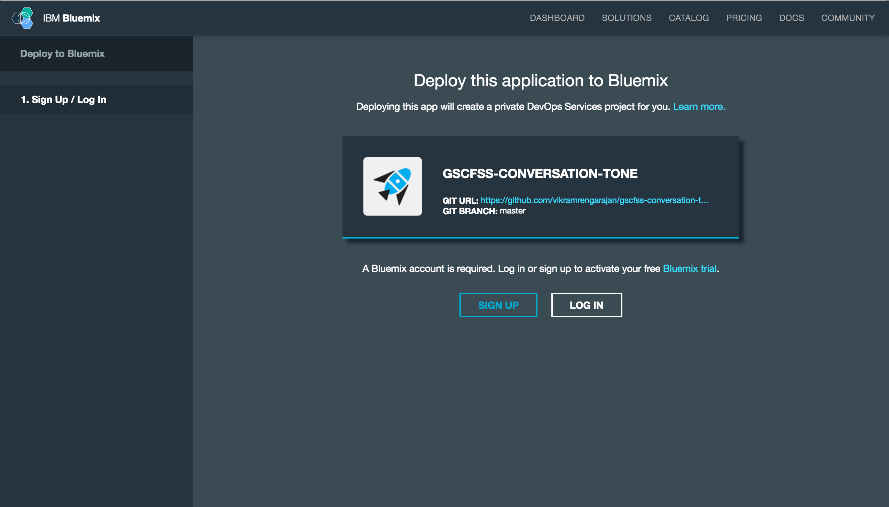
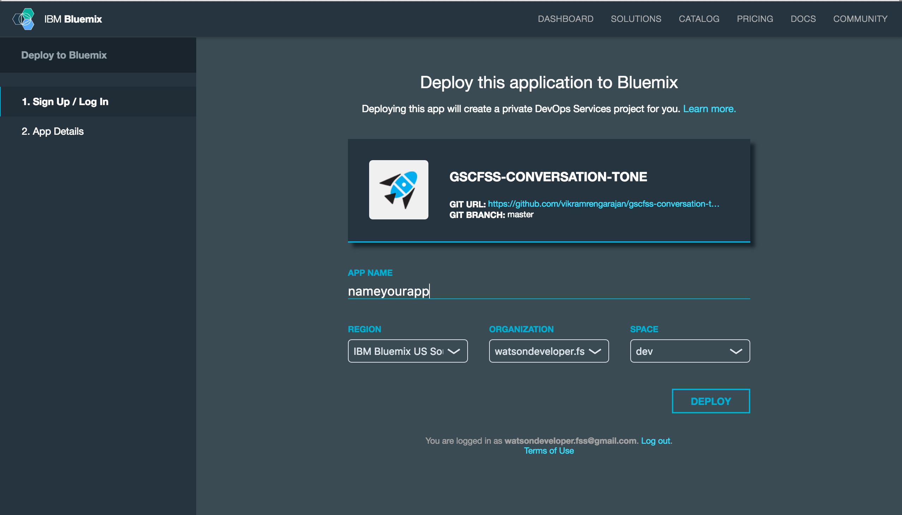
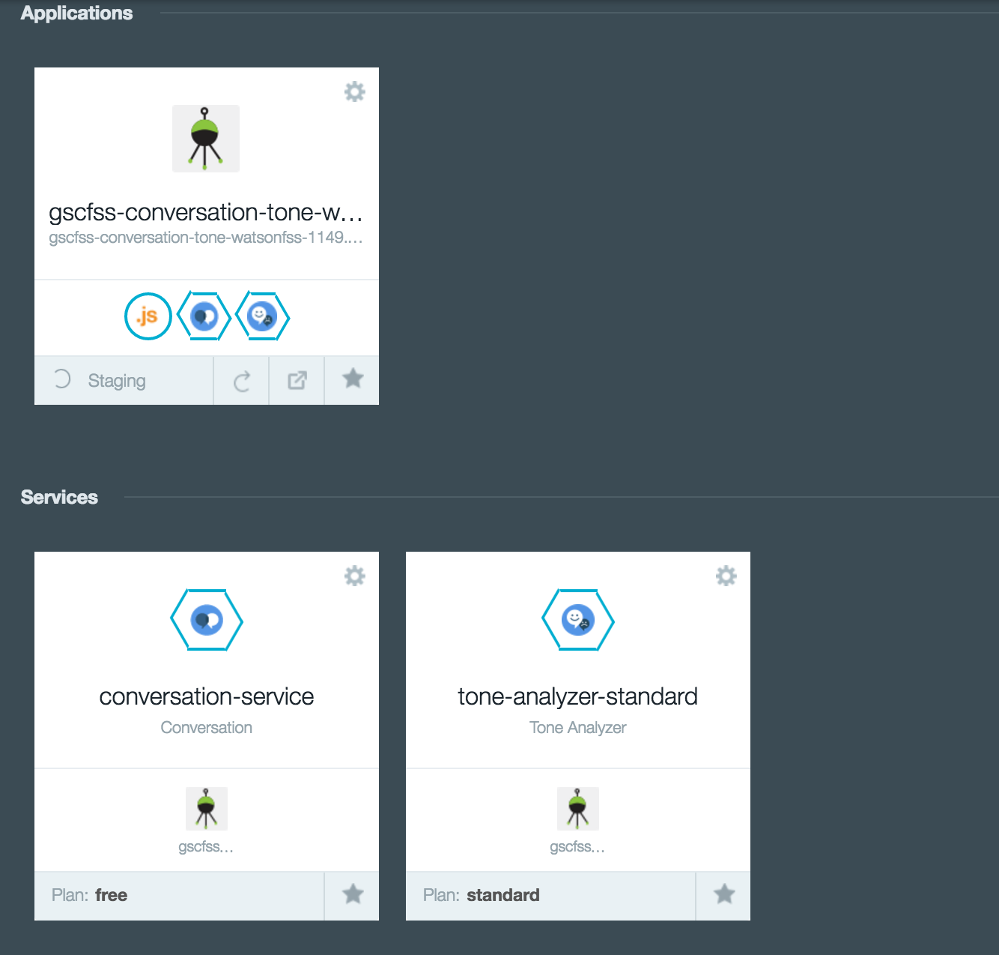

# Implementing a chat bot using Watson Cognitive Services

Welcome! These instructions describe the pre-requisites to be completed before attending the lab session. Please follow these steps to ensure that you are fully prepared to participate on the day of the lab.

## Prepare your Bluemix account

<b>1. Ensure that you have an account on [IBM Bluemix](https://bluemix.net/). If you already have a Bluemix account, then sign in to your account and proceed to [step 2](#acc_complete). </b> 

  1.1 Register for a [Bluemix account](https://bluemix.net/registration/), fill out the required details and click 'Create Account'.

&nbsp;&nbsp;&nbsp;&nbsp;&nbsp;&nbsp;&nbsp;&nbsp;&nbsp;&nbsp;&nbsp;&nbsp; 

   You will receive a message to check your mail.

&nbsp;&nbsp;&nbsp;&nbsp;&nbsp;&nbsp;&nbsp;&nbsp;&nbsp;&nbsp;&nbsp;&nbsp; 

   1.2 Please check your email and look for a registration confirmation email from Bluemix.

&nbsp;&nbsp;&nbsp;&nbsp;&nbsp;&nbsp;&nbsp;&nbsp;&nbsp;&nbsp;&nbsp;&nbsp; 

   1.3 Click on 'Confirm your account' and receive a 'Success' message.

&nbsp;&nbsp;&nbsp;&nbsp;&nbsp;&nbsp;&nbsp;&nbsp;&nbsp;&nbsp;&nbsp;&nbsp;  

   1.4 Click 'Login' and enter your Bluemix credentials.

&nbsp;&nbsp;&nbsp;&nbsp;&nbsp;&nbsp;&nbsp;&nbsp;&nbsp;&nbsp;&nbsp;&nbsp;  
   

   1.5 Create an Organization and enter an organization name.

&nbsp;&nbsp;&nbsp;&nbsp;&nbsp;&nbsp;&nbsp;&nbsp;&nbsp;&nbsp;&nbsp;&nbsp; 

   1.6 Create a Space and enter a space name. You can also choose the default space name of 'dev'.

&nbsp;&nbsp;&nbsp;&nbsp;&nbsp;&nbsp;&nbsp;&nbsp;&nbsp;&nbsp;&nbsp;&nbsp; 
   

   1.7 After you receive a success message, please click 'I'm Ready'

&nbsp;&nbsp;&nbsp;&nbsp;&nbsp;&nbsp;&nbsp;&nbsp;&nbsp;&nbsp;&nbsp;&nbsp; 
 
<b>
 You will land on your Bluemix Dashboard. 
 * If you have landed on the Dashboard view as shown below, proceed to [step 2](#acc_complete1).
 * If you did not get to the Dashboard, proceed to [step 1.8](#step_view). 
</b>

&nbsp;&nbsp;&nbsp;&nbsp;&nbsp;&nbsp;&nbsp;&nbsp;&nbsp;&nbsp;&nbsp;&nbsp; 

<a name="step_view">
   1.8 If you land on the new Bluemix interface as shown below,</a> click on the highlighted area at the top right.

&nbsp;&nbsp;&nbsp;&nbsp;&nbsp;&nbsp;&nbsp;&nbsp;&nbsp;&nbsp;&nbsp;&nbsp;    

 Click on 'Switch to Classic'.

&nbsp;&nbsp;&nbsp;&nbsp;&nbsp;&nbsp;&nbsp;&nbsp;&nbsp;&nbsp;&nbsp;&nbsp;   

You may be asked to login again. After login, you will land on the <b>Bluemix Dashboard</b>.

<a name="acc_complete">
<a name="acc_complete1">
<b> 2. Ensure that you have the necessary space available in your Bluemix account to complete the lab. Open your Bluemix Dashboard to check if you have the required space:</b></a></a>
   * The 'Services & APIs' tile shows the number of services you have available. You will require space to deploy two services during the lab. If you do not have sufficient space for two services, then delete some existing services (visible in your dashboard) before proceeding to the next step.

&nbsp;&nbsp;&nbsp;&nbsp;&nbsp;&nbsp;&nbsp;&nbsp;&nbsp;&nbsp;&nbsp;&nbsp;

   * The 'Cloud Foundry Apps' tile shows the memory you have available for apps. You will require at least 256 MB of free space to deploy the app for this lab. If you do not have 256MB of free space, then delete some existing apps (visible in your dashboard) before proceeding to the next step.

&nbsp;&nbsp;&nbsp;&nbsp;&nbsp;&nbsp;&nbsp;&nbsp;&nbsp;&nbsp;&nbsp;&nbsp;

## Deploy the App

<b>1. Click on the 'Deploy to Bluemix' button below.</b>

&nbsp;&nbsp;&nbsp;&nbsp;&nbsp;&nbsp;&nbsp;&nbsp;&nbsp;&nbsp;&nbsp;&nbsp; 

<b>2. Log in with your Bluemix account.</b>

&nbsp;&nbsp;&nbsp;&nbsp;&nbsp;&nbsp;&nbsp;&nbsp;&nbsp;&nbsp;&nbsp;&nbsp; 

<b>3. If you are asked to choose an alias, then follow these instructions. Otherwise, proceed to [step 4](#4_view) in this section. </b>

3.1 Enter a unique alias name and click create.
&nbsp;&nbsp;&nbsp;&nbsp;&nbsp;&nbsp;&nbsp;&nbsp;&nbsp;&nbsp;&nbsp;&nbsp; 

3.2 Verify your alias name and click continue.
&nbsp;&nbsp;&nbsp;&nbsp;&nbsp;&nbsp;&nbsp;&nbsp;&nbsp;&nbsp;&nbsp;&nbsp; 

<a name="4_view">
<b>4. Name your app, and then select the Region, Organization and Space where the app will be deployed. Click 'DEPLOY'.</b></a>

&nbsp;&nbsp;&nbsp;&nbsp;&nbsp;&nbsp;&nbsp;&nbsp;&nbsp;&nbsp;&nbsp;&nbsp; 

* The status of the deployment is shown. This can take approximately 2 minutes to complete.

&nbsp;&nbsp;&nbsp;&nbsp;&nbsp;&nbsp;&nbsp;&nbsp;&nbsp;&nbsp;&nbsp;&nbsp;

* The deployment process performs the following actions: 
  - Creates the application.
  - Creates a Conversation and Tone Analyzer service instance.

<b>5.  After the deployment has completed, click on the 'Deployed to Bluemix sucessfully' link.</b>

&nbsp;&nbsp;&nbsp;&nbsp;&nbsp;&nbsp;&nbsp;&nbsp;&nbsp;&nbsp;&nbsp;&nbsp;

You will land on the Overview page of your application. 

&nbsp;&nbsp;&nbsp;&nbsp;&nbsp;&nbsp;&nbsp;&nbsp;&nbsp;&nbsp;&nbsp;&nbsp;

<b>6. The application and services have been successfully deployed, and you are now ready to begin the lab!</b>

# License

  This sample code is licensed under Apache 2.0.
  Full license text is available in [LICENSE](LICENSE).

## Open Source @ IBM

  Find more open source projects on the
  [IBM Github Page](http://ibm.github.io/).

